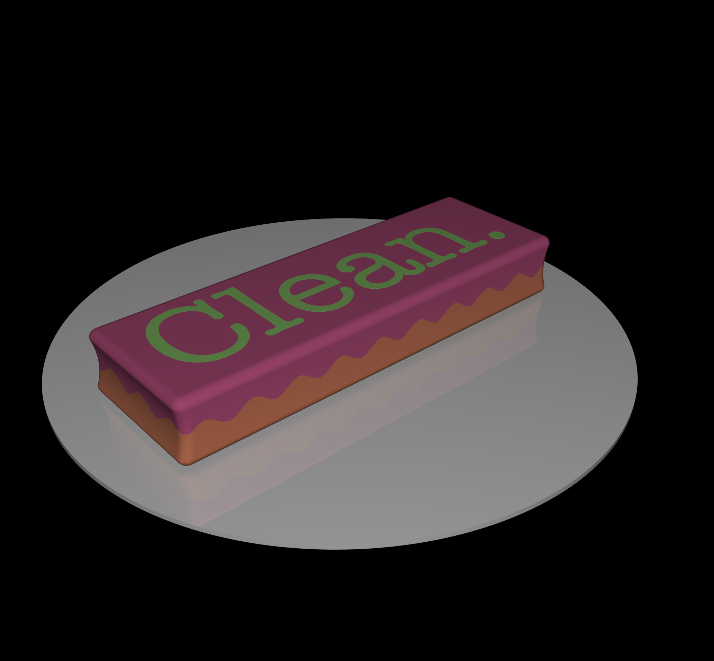
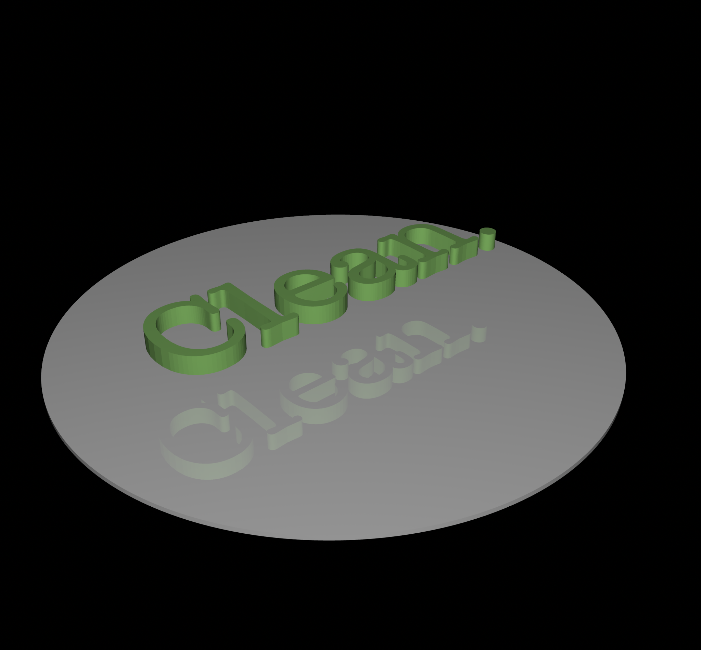
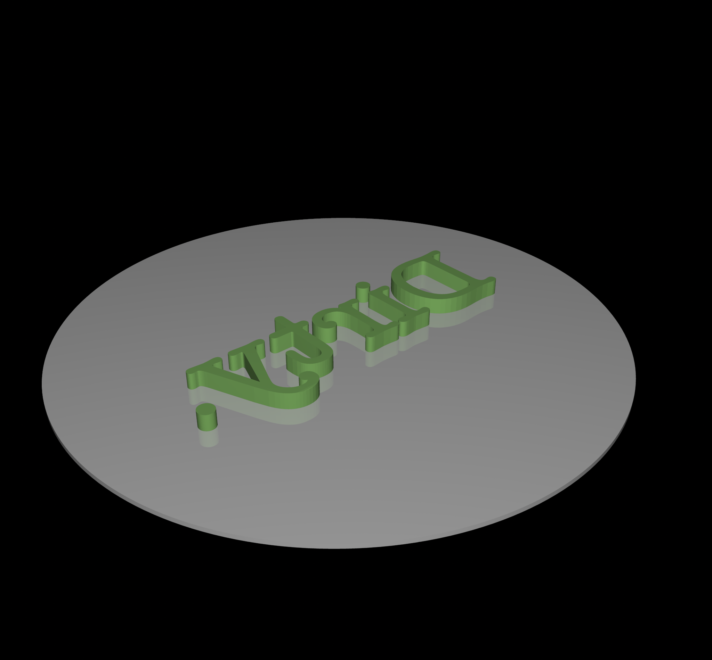
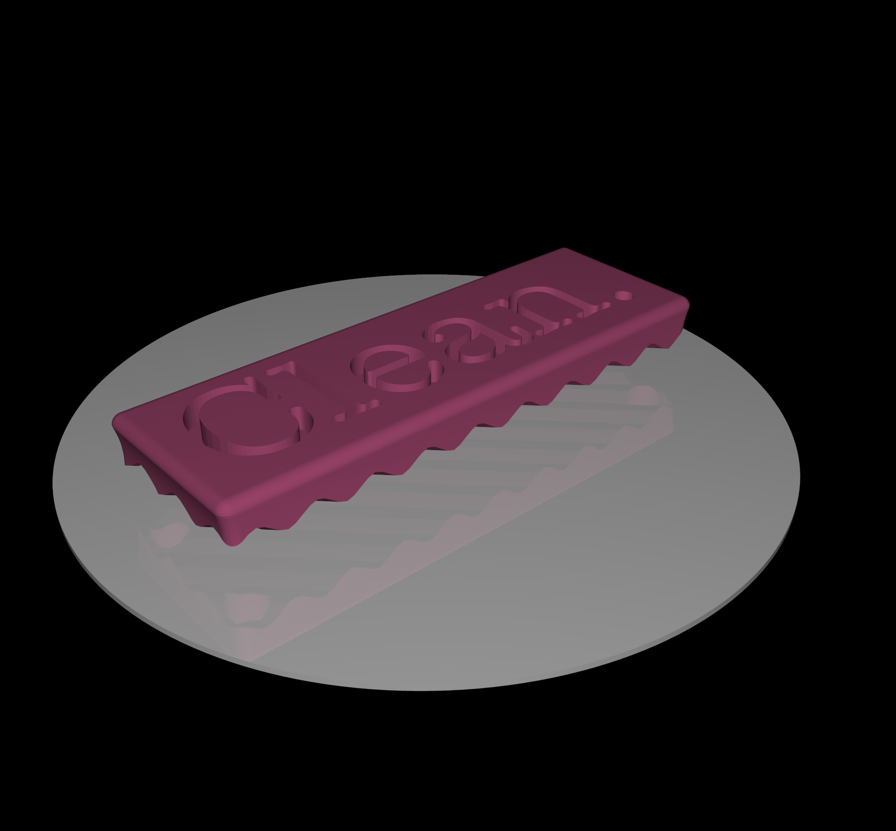
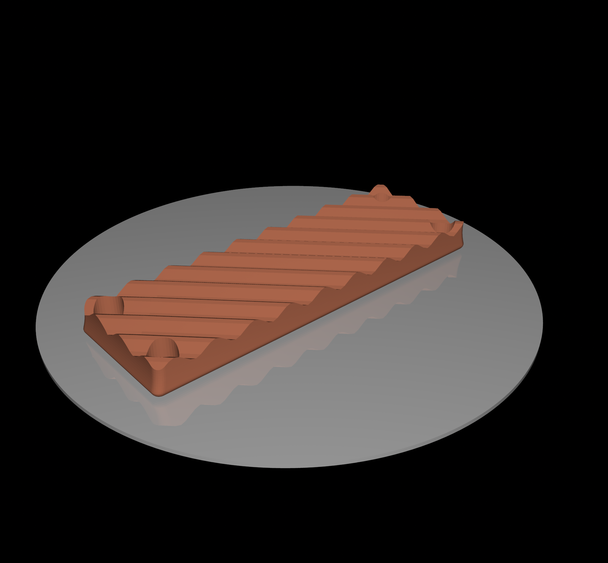

# shapes/models/practical/dirty_clean_magnet/

A dirty/clean indicator to put on the dishwasher.  
**IMPORTANT** the .3mf file should have a built-in pause at the start of layer 69.  
This pause is for you to drop in the magnets !  
No glue is necessary.  

I highly recommend [KJ Magnetics](https://kjmagnetics.com) for all your magnet needs. I've used them for decades.  

The voids in this model will accept a cylinder that is 1/4" in diameter and 1/2" tall.  
There are four voids, one in each corner, but I find that actually putting in four N42 magnets is a little much.  Instead, try two in opposite corners.  

The magnets I use for this are ["D48" 1/4" x 1/2" N42 Cylinder Magnets from KJ Magnetics](https://www.kjmagnetics.com/d48-neodymium-cylinder-magnet).  

There are a couple non-manifold edges in dirty_clean_magnet_200_p1.stl , which is the positive word "Clean", but it seems to slice & print okay.  

  
  
  
  
  
